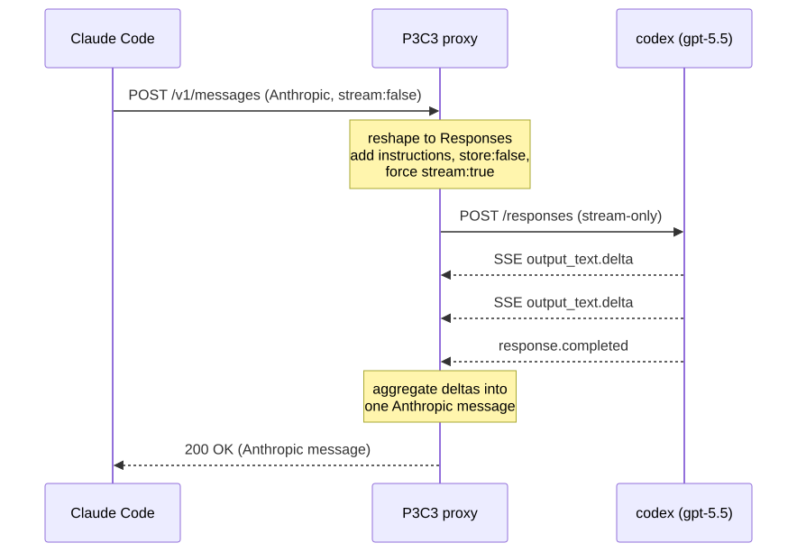

# P3C3: Pedantic PAI Proxies Claude-Compatible Codex


Local pydantic/FastAPI proxy that lets the `claude` CLI (Claude Code) drive OpenAI-Responses-API
backends, **codex** as the headline, Ollama and any Responses backend too: Anthropic Messages
API in → OpenAI Responses API out → Anthropic shapes (incl. SSE streaming and tool calls) back.
Plus a clean-room installer that stands the whole thing up (Claude Code + the proxy + PAI skills)
on a fresh Ubuntu box.

## How it works



Claude Code only speaks the Anthropic Messages API; codex only speaks the OpenAI Responses API.
The proxy sits on localhost and translates each request on the way out and each response on the
way back, so Claude Code drives codex without knowing the difference. The proxy runs no model:
codex (or Ollama) is the brain.

**A single turn, end to end** (a non-streaming `claude -p` request; interactive sessions stream the reply back instead):



## Prerequisites

You hand the install to your coding agent (codex), so codex itself is the one thing you set up by
hand first:

- **codex CLI installed.** `npm i -g @openai/codex` (you're probably already running it).
- **codex authenticated.** `codex login` (ChatGPT account) writes `~/.codex/auth.json`, which the
  proxy reads.

Everything else, the agent installs.

## Setup: let your LLM install it (recommended)

Hand the whole job to your agent (codex) and let it figure out the install. Works on WSL Ubuntu
or any fresh Ubuntu.

<details>
<summary><b>📋 Paste this into codex, verbatim (click to expand)</b></summary>

```text
Build the P3C3 stack on this box.

FIRST, verify the prerequisites: confirm `codex --version` works and ~/.codex/auth.json exists
(the proxy reads that token). If auth.json is missing, STOP and tell me to run `codex login`;
do not continue.

Then figure out the installs yourself and execute autonomously: do NOT ask me to confirm,
choose, or approve anything. This box may be x86_64; adapt commands as needed.

Goal: Claude Code (the `claude` CLI) driving OpenAI codex (gpt-5.5) through this repo's local
proxy, with the PAI skill Packs installed. Build it, then verify with a real turn.

What to set up (install whatever each needs, your choice of tooling):

  1. Clone this repo:
       git clone https://github.com/memorydial/p3c3 ~/p3c3 && cd ~/p3c3

  2. Claude Code:
       npm i -g @anthropic-ai/claude-code          (needs Node >=20; install Node if absent)

  3. The proxy (this repo), run it however you like:
       uv sync && uv run uvicorn server:app ...
       OR  python3 -m venv .venv && .venv/bin/pip install fastapi httpx uvicorn pydantic
           && .venv/bin/uvicorn server:app ...
     Start it with PROXY_UPSTREAM_MODE=codex on 127.0.0.1:4000. It reads ~/.codex/auth.json.

  4. PAI skills:
       clone https://github.com/danielmiessler/Personal_AI_Infrastructure
       copy each  Packs/<Name>/src  ->  ~/.claude/skills/<Name>   (skip Interceptor, macOS-only)
       bun is only needed for the PAI Tools/*.ts; skip it otherwise.

  5. Wire Claude Code to the proxy:
       write ~/.claude/settings.json:
         {"permissions":{"defaultMode":"acceptEdits","allow":["Write","Read","Edit","Bash"]}}
       make a `pai-proxy` helper (start/stop/restart/status; start brings the proxy up if down),
       and a `pai-codex` launcher that runs `pai-proxy start` FIRST and only execs Claude Code
       if the proxy is up (else refuse, so you never land in a broken session):
         ANTHROPIC_BASE_URL=http://127.0.0.1:4000 ANTHROPIC_AUTH_TOKEN=proxy ANTHROPIC_API_KEY= \
         ANTHROPIC_MODEL=gpt-5.5 ANTHROPIC_SMALL_FAST_MODEL=gpt-5.5 \
         CLAUDE_CODE_DISABLE_NONESSENTIAL_TRAFFIC=1 claude --model gpt-5.5 "$@"
       (install/ubuntu-setup.sh generates exactly these plus pai-doctor; copy its pattern.)

  6. Verify:
       curl 127.0.0.1:4000/health    ->   {"ok":true}
       pai-codex -p "say hi"         ->   returns a reply

Must get right / landmines:

  - ANTHROPIC_SMALL_FAST_MODEL must equal the codex model. If unset, Claude Code's background
    model 404s and startup HANGS (exit 124). The launcher above sets it.

  - Never use `claude --bare`: it forces API-key billing and bypasses the proxy.

  - Don't patch the proxy for codex 400/502s. It normalizes codex's required fields (instructions,
    store:false, stream-only, role-typed input_text/output_text, Cloudflare headers, omitted
    max_output_tokens). A 400/502 usually means stale code or an expired token: re-pull or
    `codex login` to refresh.

  - Container/root only: Claude Code refuses --dangerously-skip-permissions as root; the
    settings.json allow-list above is what makes tools run. (On WSL you're a normal user, fine.)

  - Don't claim success without the step-6 verify turn.

  - Stuck? install/ubuntu-setup.sh is a known-good reference for Ubuntu (root and non-root).
    Read it or run it, and adapt as needed on x86_64.
```

</details>

**Then use it:**
```bash
exec $SHELL -l            # fresh shell so the pai-codex launcher is on PATH
pai-codex                 # interactive Claude Code on codex, with PAI skills
pai-codex -p "do X"       # headless one-shot
```

**If the proxy stops,** `pai-codex` restarts it on the next run and refuses to open Claude Code if
it can't come up (no broken sessions). Manage it with `pai-proxy {start|stop|restart|status|logs}`
and diagnose the whole stack with `pai-doctor`.

Container and WSL specifics in [`install/RUNBOOK.md`](install/RUNBOOK.md) and [`install/WSL.md`](install/WSL.md).

## Local Ollama needs no proxy

Ollama ≥ 0.14.0 natively serves the Anthropic Messages API, so for local models you skip the proxy
entirely. Serve it with a context window big enough for Claude Code (the 4k default truncates):

```bash
OLLAMA_CONTEXT_LENGTH=64000 ollama serve     # the 4k default truncates Claude Code
export ANTHROPIC_AUTH_TOKEN=ollama ANTHROPIC_API_KEY="" ANTHROPIC_BASE_URL=http://localhost:11434
claude --model qwen2.5
```

The proxy covers the leg Ollama doesn't: backends that only speak OpenAI shapes (api.openai.com,
codex). Its default upstream is Ollama's own `/v1/responses`, so the codex translation layer is
developable locally for free.

## Configuration

| Env var | Default | Purpose |
|---------|---------|---------|
| `OPENAI_BASE_URL` | `http://localhost:11434/v1` (or codex base in codex mode) | Upstream Responses API base |
| `OPENAI_API_KEY` | unset | Upstream auth; omitted entirely when unset (Ollama needs none) |
| `PROXY_UPSTREAM_MODE` | `openai` | `codex` enables the ChatGPT-codex adapter (see below) |
| `PROXY_MODEL_MAP` | `{}` | JSON alias map, e.g. `{"sonnet-codex":"gpt-5.1-codex"}` |
| `PROXY_READ_TIMEOUT` | `300` | Upstream read timeout (s); raise for slow local models |
| `PROXY_DEBUG` | off | Log model/stream/counts + upstream errors (never keys, never prompt content) |
| `PROXY_HOST` / `PROXY_PORT` | `127.0.0.1` / `4000` | Bind address |
| `CODEX_AUTH_PATH` | `~/.codex/auth.json` | Where codex mode reads the OAuth token |

### Codex mode (ChatGPT-OAuth backend)

`PROXY_UPSTREAM_MODE=codex` targets `chatgpt.com/backend-api/codex` (gpt-5.5), reading the `codex`
CLI's own token from `~/.codex/auth.json`. The adapter handles the backend's required behaviours:
`instructions` required, `store:false`, stream-only, role-typed content parts, and the same
identity headers the official codex CLI sends.

## What it implements

- `GET /health` (liveness) · `GET /debug` (config + readiness snapshot, never the token)
- `POST /v1/messages`: non-streaming + Anthropic SSE streaming, tool_use/tool_result ↔
  function_call/function_call_output, system→instructions, model aliasing, anthropic-shaped errors
- `POST /v1/messages/count_tokens`: estimate stub (Ollama 404s this endpoint and Claude Code
  calls it, upstream issue ollama/ollama#13949)

## Status

Tested end-to-end against the `claude` CLI on Ubuntu 24.04, both backends (Ollama and
ChatGPT-codex), plain text and tool round-trips. Unit tests cover the request, response, and
streaming mappings (`uv run pytest`); the full container check is
`scripts/container-test.sh [ollama|codex]`.

## Known limitations

- **count_tokens is a chars/4 estimate, not a real tokenizer**: Claude Code uses it to time context
  compaction, so long sessions may compact early/late. (On the direct-Ollama path it 404s entirely.)
- **Ollama upstream reports `end_turn` on truncation**: it doesn't signal `incomplete`, so the proxy
  can't emit `stop_reason: max_tokens`. Real OpenAI maps correctly.
- **codex token auto-refresh not implemented**: if calls start 401/502-ing after a long idle, refresh
  with `codex login` (or any `codex exec "ok"` turn).

## Docs

- [`install/RUNBOOK.md`](install/RUNBOOK.md): per-step expected output, codex-auth branch, container path, troubleshooting
- [`install/WSL.md`](install/WSL.md): WSL Ubuntu setup
